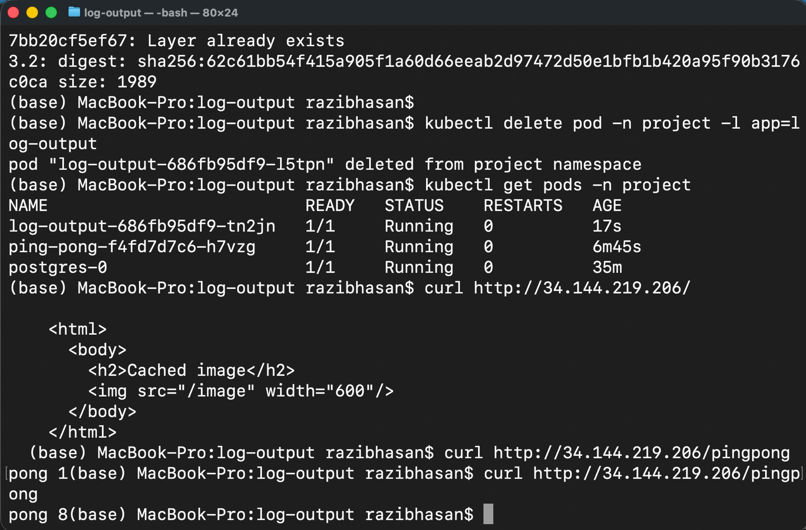

# Kubernetes Exercise 3.2 – GKE Ingress

This repository contains the solution for **Exercise 3.2 (Back to Ingress)** of the Kubernetes course.

The goal of this exercise was to deploy multiple applications to **Google Kubernetes Engine (GKE)** and expose them using a **Layer 7 Ingress** with path-based routing.

---

## Deployed Applications

### 1. log-output
- Node.js + Express application
- Fetches and caches a random image
- Responds with **HTTP 200 on `/`** (required for GKE Ingress health checks)

### 2. ping-pong
- Node.js application backed by PostgreSQL
- Responds on `/pingpong`
- Maintains a persistent counter in the database

### 3. PostgreSQL
- Deployed as a StatefulSet
- Persistent volume used for data storage
- Shared only with ping-pong

All resources are deployed inside the `project` namespace.

---

## Ingress Configuration

A single **GKE Ingress** is used to expose both applications:

| Path        | Service          | Description                 |
|------------|------------------|-----------------------------|
| `/`        | log-output-svc   | Default route (health check) |
| `/pingpong` | ping-pong-svc    | Ping-pong counter endpoint |

Ingress uses **NodePort services**, as required by GKE.

---

## Verification

The deployment was verified using the public GKE Ingress IP:

```bash
curl http://<INGRESS_IP>/
curl http://<INGRESS_IP>/pingpong
```

---

## Proof of Completion

Both endpoints return valid **HTTP 200** responses through the GKE Ingress.

The following screenshots demonstrate the successful deployment and routing:

### Ingress Assigned External IP
This screenshot shows that the GKE Ingress was successfully provisioned with a public external IP address.


### Successful Responses From Both Routes
This screenshot confirms that:
- `/` correctly routes to **log-output**
- `/pingpong` correctly routes to **ping-pong**



---
