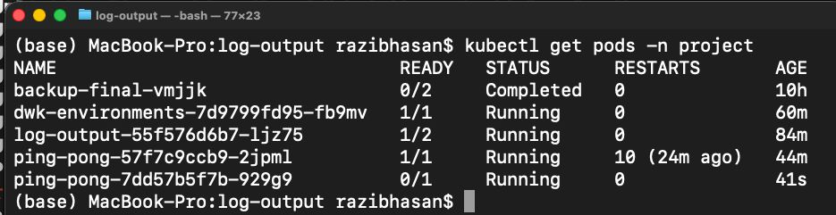

# Exercise 4.2 – Readiness Probe with Broken Database

## Goal
Ensure the Ping-pong application is marked **Not Ready** when it is not connected to the database.

---

## Readiness Probe Configuration

The Ping-pong deployment uses an HTTP-based readiness probe that checks database connectivity via the `/ready` endpoint.

readinessProbe:
  httpGet:
    path: /ready
    port: 3000
  initialDelaySeconds: 5
  periodSeconds: 5

---

## Application Readiness Endpoint

The application exposes `/ready`, which performs a database query:

- Returns **200 OK** if the database is reachable
- Returns **503 Service Unavailable** if the database is unreachable

This ensures readiness reflects real database availability.

---

## Intentional Database Failure (Test Case)

To verify the probe works, the database connection was intentionally broken by modifying the environment variable:

- name: POSTGRES_HOST
  value: wrong-postgres

---

## Expected Behavior

- Container stays **Running**
- Pod stays **Not Ready (0/1)**
- Kubernetes does **not** route traffic to the service

---

## Result

Kubernetes correctly prevents traffic from being routed to the Ping-pong service when the database is unreachable.

---

## Proof

See screenshot from terminal

Observed pod state:

READY: 0/1
STATUS: Running

---

## EnD