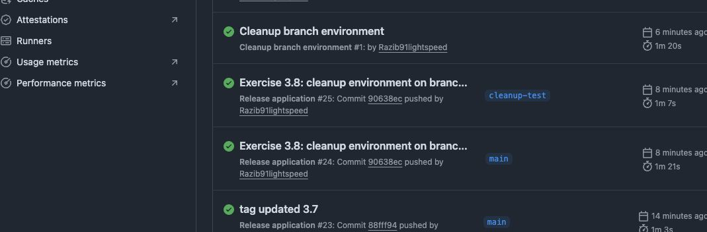
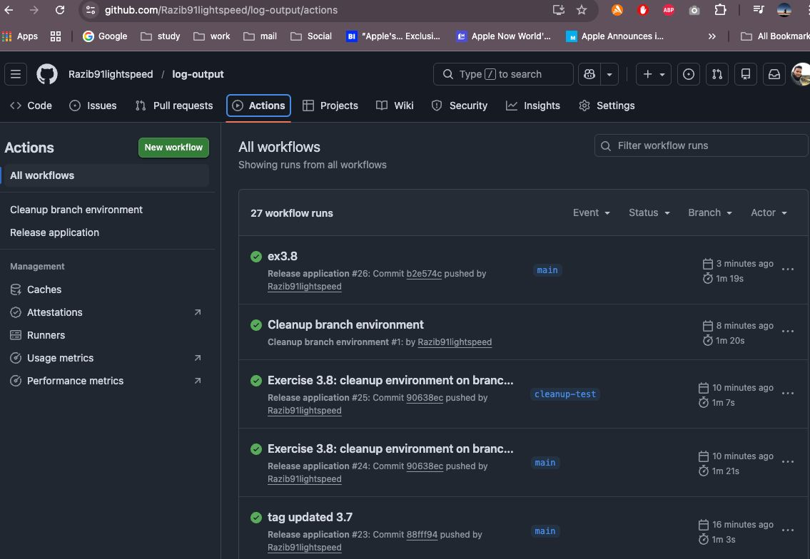

# Exercise 3.8 – Environment Cleanup on Branch Deletion

This task extends the CI/CD pipeline by automatically deleting Kubernetes environments when a Git branch is deleted.

A separate GitHub Actions workflow listens to branch deletion events and removes the corresponding Kubernetes namespace. The `main` branch is protected and never deleted.

This ensures that temporary branch environments do not remain in the cluster after development ends and keeps the Kubernetes environment clean and up to date.

## Exercise 3.8 completed successfully.

