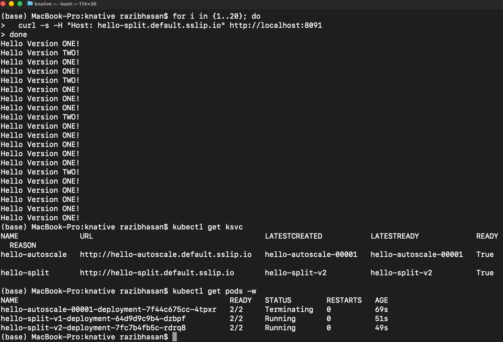

# Exercise 5.6 – Trying Serverless with Knative

## Goal

Install **Knative Serving** on a local k3d cluster and verify:

- Knative installation works
- A serverless service can be deployed
- Autoscaling works
- Traffic splitting between revisions works

---

## Cluster Setup

A new k3d cluster was created without Traefik (required by Knative):

```bash
k3d cluster create knative \
  --agents 2 \
  -p 8091:80@loadbalancer \
  -p 8092:30080@agent:0 \
  --k3s-arg "--disable=traefik@server:0"
```

Switch context:

```bash
kubectl config use-context k3d-knative
```

---

## Install Knative Serving

```bash
kubectl apply -f serving-crds.yaml
kubectl apply -f serving-core.yaml
kubectl apply -f kourier.yaml
```

Enable Magic DNS:

```bash
kubectl patch configmap/config-domain \
  -n knative-serving \
  --type merge \
  -p '{"data":{"sslip.io":""}}'
```

---

## Deploy Services

### Autoscaling service

```bash
kubectl apply -f knative/autoscale.yaml
```

### Traffic split service

```bash
kubectl apply -f knative/traffic-split.yaml
```

---

## Verification

### 1. Services created

```bash
kubectl get ksvc
```

Both services show `READY=True`.

---

### 2. Traffic splitting

Multiple requests were sent:

```bash
for i in {1..20}; do
  curl -H "Host: hello-split.default.sslip.io" http://localhost:8091
done
```

Output alternates between:

```
Hello Version ONE!
Hello Version TWO!
```

This confirms:
- two revisions running
- requests distributed between versions
- Knative traffic routing working

---

## Proof

Screenshot shows:
  - curl requests returning both versions

 ```bash
  kubectl get ksvc
  ```
 ```bash
 kubectl get pods -w
 ```

  

---

## Result

Knative Serving successfully installed and verified:
- serverless deployment
- autoscaling
- traffic splitting

Exercise completed successfully.

# End

