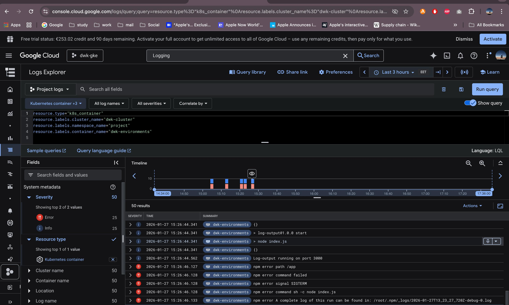

## Exercise 3.12 – GKE Logging

GKE Cloud Logging was enabled using the built-in observability features.
Application logs are automatically collected from Kubernetes container stdout.

To verify logging, application logs from the running workload were observed
in Google Cloud Logs Explorer.

