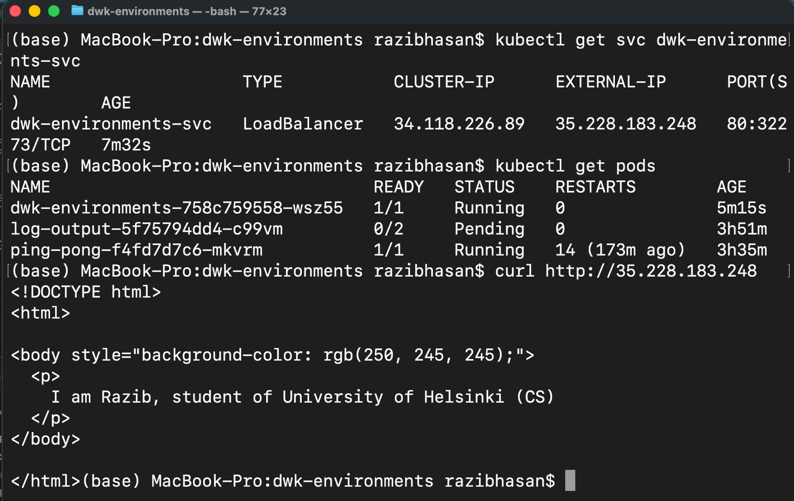
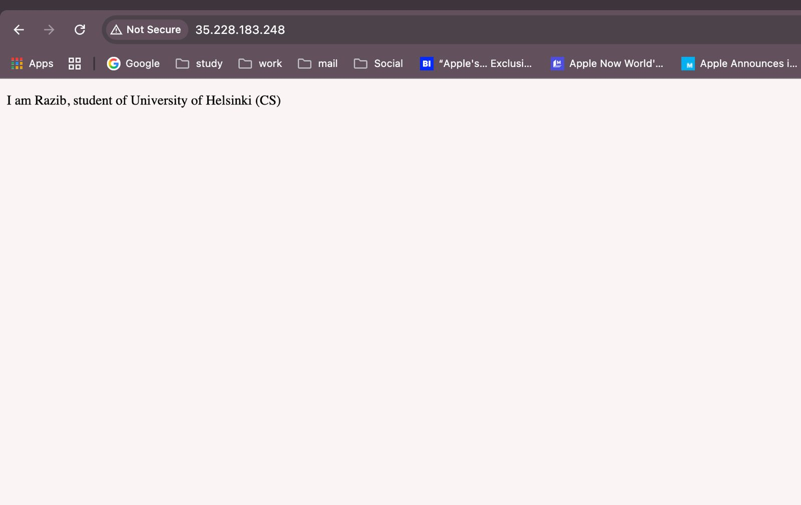

# Exercise 3.5 – Deployment with Kustomize on Google Kubernetes Engine

## Objective

The goal of this task was to configure a Kubernetes project to use **Kustomize** for deployment configuration and deploy a simple web application to **Google Kubernetes Engine (GKE)**.
This exercise demonstrates how Kustomize simplifies multi-resource deployments and enables clean image management, which is essential for building a continuous deployment pipeline.

---

## Application Overview

A minimal static website was created using **Nginx**.
The application serves a single HTML page with a gray background and static content.

### Application files
- `index.html` – static web page
- `Dockerfile` – builds an Nginx-based container image

The container image was built locally and pushed to **Google Artifact Registry** so it can be pulled by GKE.

---

## Docker Image

The Docker image was built explicitly for the `linux/amd64` architecture to ensure compatibility with GKE nodes.

Image location in Artifact Registry:

´´´bash
europe-north1-docker.pkg.dev/project-d585011e-65cd-481e-b8a/k8s-images/colorcontent:latest
´´´

---

## Kubernetes Manifests

Two Kubernetes resources were defined for the application.

### Deployment
- Name: `dwk-environments`
- Replicas: 1
- Container image defined using a placeholder (`PROJECT/IMAGE`)
- Container port exposed: 80

### Service
- Name: `dwk-environments-svc`
- Type: `LoadBalancer`
- Exposes the application publicly on port 80

---

## Kustomize Configuration

Kustomize was configured using a `kustomization.yaml` file located at the root of the application directory.

The configuration:
- Lists the deployment and service manifests as resources
- Replaces the placeholder image (`PROJECT/IMAGE`) with the actual Artifact Registry image
- Allows deployment of all resources using a single command

Deployment was executed with:

´´´bash
kubectl apply -k .
´´´

This applies all Kubernetes resources in the correct order.

---

## Deployment Verification

After deployment, the following checks were performed:

1. The `dwk-environments` pod reached the `Running` state.
2. The service was assigned an external IP by Google Cloud Load Balancer.
3. The application was successfully accessed via the external IP using a web browser.
4. The expected static web content was displayed correctly.

---

## Screenshots

The following screenshots are included as proof of successful deployment:
- Pods and Service

- Web application accessed via external IP in a browser

---

## Result

- Kustomize is correctly configured and operational
- The application is successfully deployed to Google Kubernetes Engine
- Image management is handled cleanly through Kustomize
- The project is ready to be extended with a GitHub Actions–based continuous deployment pipeline

This completes **Exercise 3.5** successfully.
