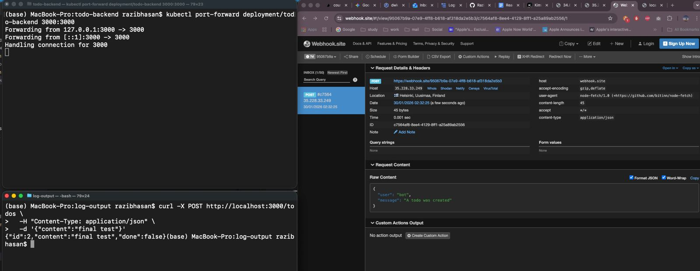
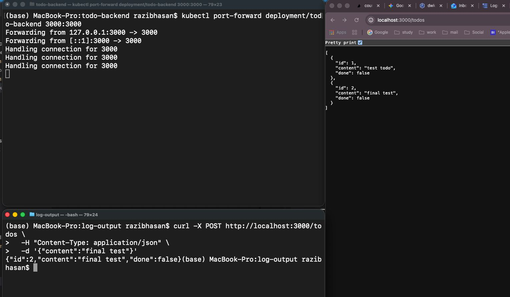
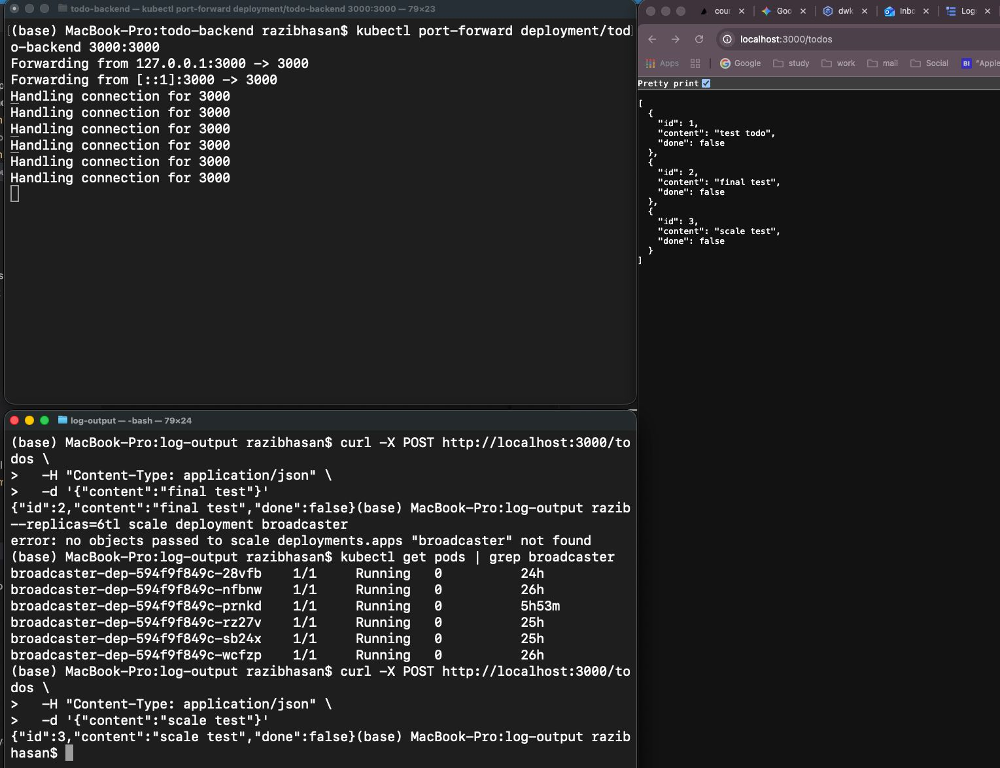

# Exercise 4.6 — Broadcaster Service

A separate broadcaster service was implemented to forward todo status messages via NATS to an external webhook endpoint.

## Architecture

- todo-backend publishes events to NATS when todos are created/updated
- broadcaster subscribes to NATS messages
- broadcaster forwards messages to an external webhook service
- broadcaster runs with 6 replicas without duplicate delivery

## Verification

1. Creating todos triggers NATS messages
2. Broadcaster receives and forwards messages
3. External webhook receives JSON payload
4. Scaling broadcaster to 6 replicas does not create duplicates

## Proof screenshots
- On Terminal
- 
- 
- 

Exercise requirements satisfied.

# End