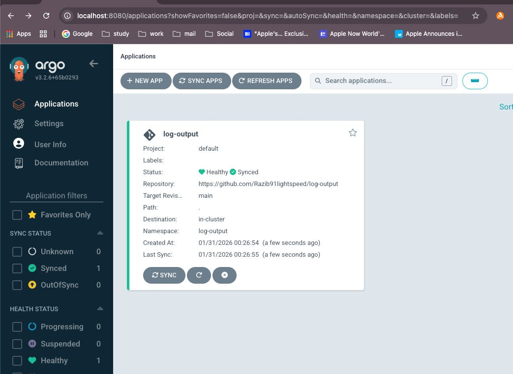
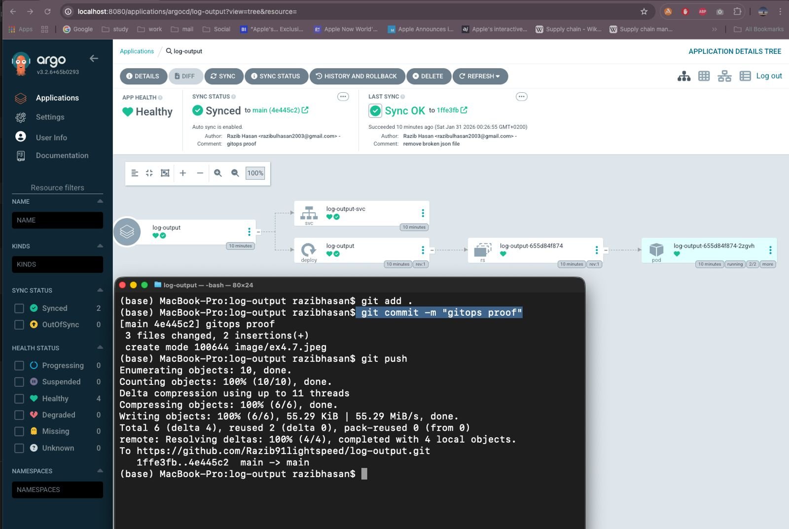

# Exercise 4.7 – Baby steps to GitOps

This exercise demonstrates moving the **log-output** application to a GitOps workflow using **ArgoCD**.
The goal is to prove that when a commit is pushed to GitHub, ArgoCD automatically updates the application in Kubernetes.

---

## Steps performed

1. Installed ArgoCD into the Kubernetes cluster.
2. Created a new ArgoCD application pointing to the GitHub repository:
   ```
   https://github.com/Razib91lightspeed/log-output
   ```
3. Enabled **automatic sync** in ArgoCD.
4. Pushed a new commit (`gitops proof`) to the repository.
5. ArgoCD detected the new commit and automatically synchronized the cluster state.

This confirms GitOps is working: **Git is the source of truth**, and ArgoCD continuously reconciles the cluster with the repository.

---

## Proof

### ArgoCD application synced automatically



### Commit pushed to repository



---

## Result

After pushing a commit:

- ArgoCD automatically detected the change
- Application status became **Healthy**
- Sync status became **Synced**
- New commit hash was deployed

The cluster is now managed using GitOps.

# End
