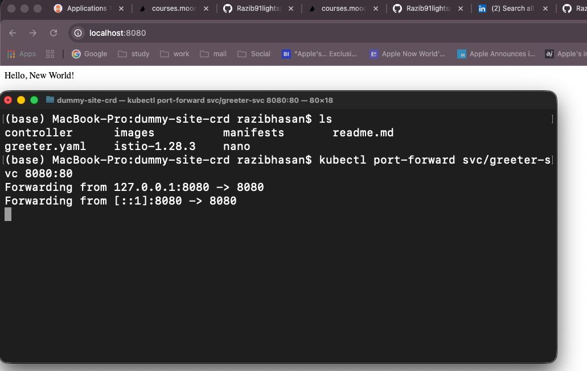
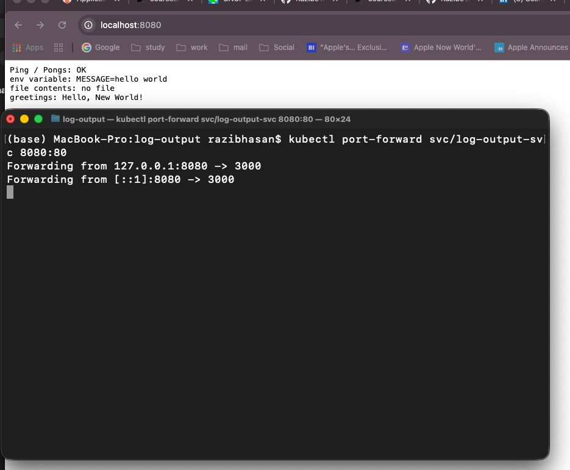
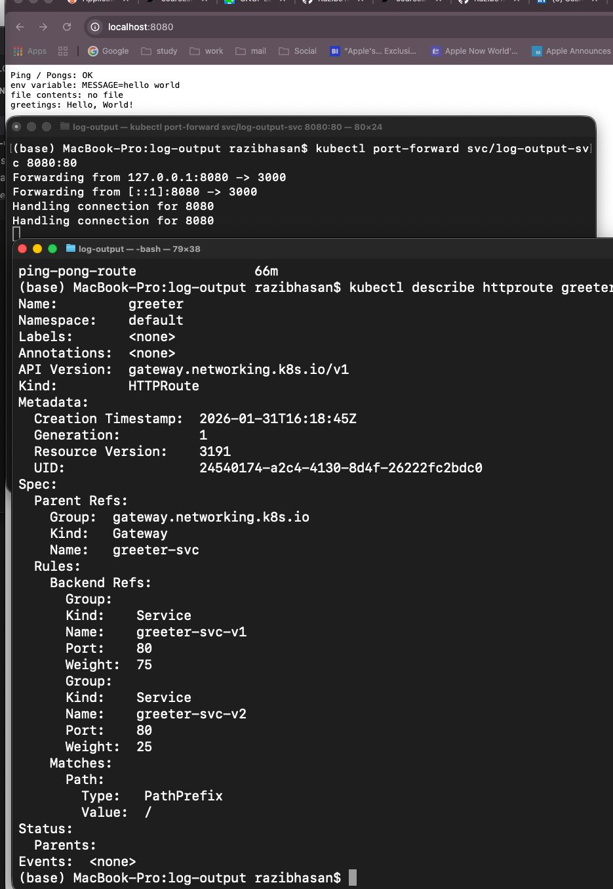

# Exercise 5.3 — Log app, the Service Mesh Edition

This exercise integrates the **log-output application** with **Istio Ambient Service Mesh** and adds a new **greeter microservice**.
Traffic is split between two greeter versions using **HTTPRoute weighted routing (75% / 25%)**.

---

## Goals

- Deploy log-output inside Istio ambient mesh
- Add greeter service
- Log-output fetches greeting via HTTP
- Deploy 2 versions of greeter (v1, v2)
- Split traffic using HTTPRoute
- Verify greeting + routing

---

## Architecture

log-output → greeter-svc → (greeter-v1 | greeter-v2)
HTTPRoute controls 75/25 split

---

## Deployment Steps

### Enable ambient mesh
```bash
kubectl label namespace default istio.io/dataplane-mode=ambient
```

### Apply manifests
```bash
kubectl apply -f manifests/
```

### Port forward
```bash
kubectl port-forward svc/log-output-svc 8080:80
```

### Open browser
```
http://localhost:8080
```

---

## Verification

### 1. Greeter integration works

Browser output shows:

```
greetings: Hello, World!
```

---

### 2. Two greeter versions running

```bash
kubectl get pods | grep greeter
```

---

### 3. Traffic splitting configured

```bash
kubectl describe httproute greeter
```

Expected:

```
greeter-svc-v1 weight: 75
greeter-svc-v2 weight: 25
```

---

## Proof Screenshots

### Application + greeting visible


### Pods/services running


### HTTPRoute 75/25 traffic split


---

## Result

✔ Service mesh enabled
✔ Greeter integrated
✔ Two versions deployed
✔ Traffic splitting working
✔ Greeting visible in UI

Exercise 5.3 completed successfully.

# End