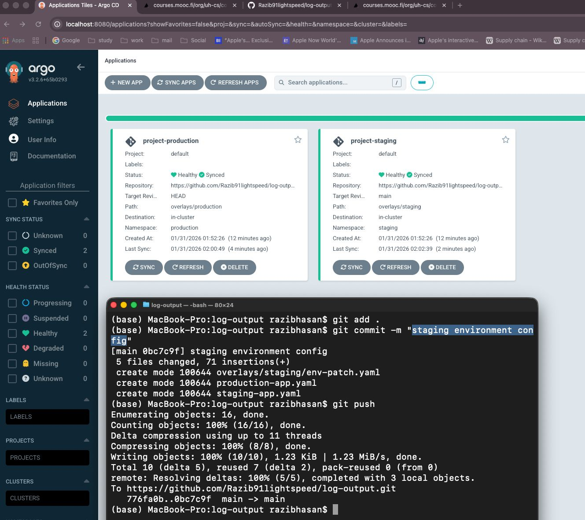
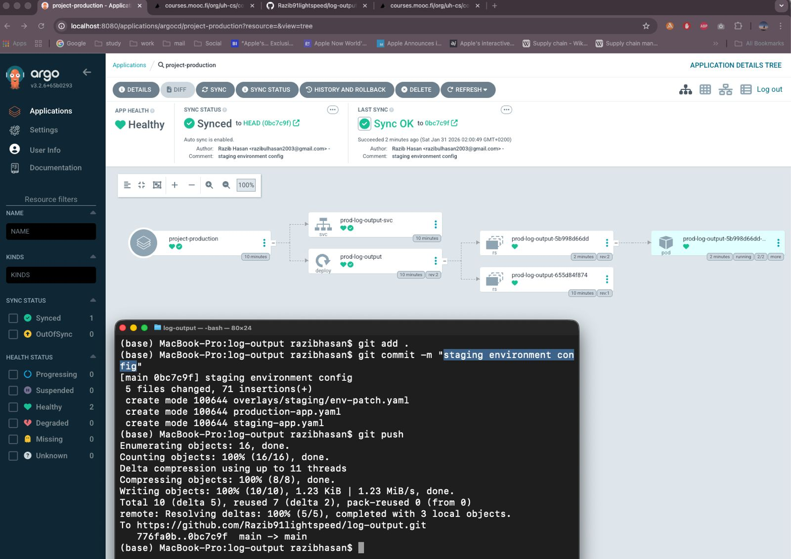

# Exercise 4.9 — GitOps environments

The project was enhanced to support GitOps deployment with two separate environments using ArgoCD and Kustomize.

## Environments

Two environments were created:

- **staging** → namespace `staging`
- **production** → namespace `production`

Each environment has its own overlay configuration based on a shared base.

```
base/
overlays/staging/
overlays/production/
```

## Deployment behavior

- Every commit to **main** automatically deploys to **staging**
- Tagged commits deploy to **production**
- ArgoCD continuously syncs cluster state from Git

## Environment differences

**Staging**
- Broadcaster logs messages only
- No database backups

**Production**
- Full system behavior enabled

## Proof

ArgoCD showing both environments synced from Git:



Git commit automatically triggering deployment:



The screenshots confirm successful GitOps deployment for both environments.
# End