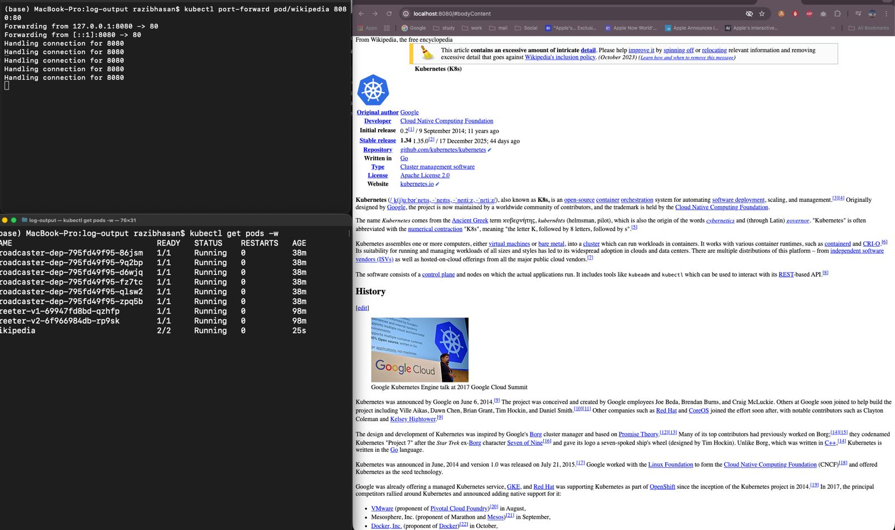

# Exercise 5.4 – Wikipedia with Init Container and Sidecar

## Goal

Create a Kubernetes Pod that serves Wikipedia pages using:

- Main container (nginx) → serves static files
- Init container → downloads Kubernetes Wikipedia page before startup
- Sidecar container → periodically fetches a random Wikipedia page and updates content

This demonstrates how init containers prepare application state and how sidecars extend functionality at runtime.

---

## Architecture

Pod contains three containers:

1. Init container
   - Uses curl
   - Downloads:
     https://en.wikipedia.org/wiki/Kubernetes
   - Saves to shared volume as `/data/index.html`
   - Runs once before nginx starts

2. Main container (nginx)
   - Serves files from:
     `/usr/share/nginx/html`
   - Displays the downloaded Wikipedia page

3. Sidecar container
   - Sleeps randomly between 5–15 minutes
   - Downloads:
     https://en.wikipedia.org/wiki/Special:Random
   - Overwrites `/data/index.html`
   - Updates the page automatically

All containers share the same `emptyDir` volume.

---

## Files

- `manifests/wikipedia-pod.yaml` – Pod definition

- 

---

## Deployment Steps

Apply the pod:

```bash
kubectl apply -f manifests/wikipedia-pod.yaml
```

Check pod status:

```bash
kubectl get pods
```

Expected:

```text
wikipedia   2/2   Running
```

Port forward:

```bash
kubectl port-forward pod/wikipedia 8080:80
```

Open in browser:

```
http://localhost:8080
```

---

## Verification

The following confirms correct behavior:

- Pod shows `2/2 Running`
- Browser displays Kubernetes Wikipedia page
- Content automatically changes over time (sidecar updates)
- nginx serves files from shared volume

Screenshot proof:

```
image/ex.5.4.jpeg
```

---

## Concepts Demonstrated

Init Containers:
- Prepare environment before app starts
- Download initial content

Sidecar Containers:
- Run alongside main app
- Add extra functionality (periodic updates)

Shared Volume:
- Enables file sharing between containers

---

## Result

The pod successfully:
- Downloads page before startup
- Serves content with nginx
- Periodically refreshes content
- Demonstrates both init and sidecar patterns

Exercise 5.4 completed.

# End