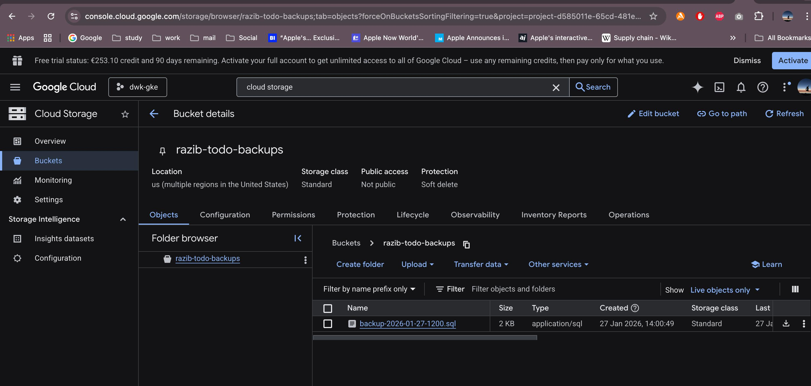
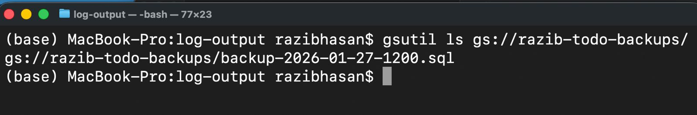

# Exercise 3.10 – Database Backup CronJob

This task implements a Kubernetes **CronJob** that backs up the PostgreSQL database once per day using `pg_dump` and stores the backup in **Google Cloud Storage**.

## What was implemented

- A Kubernetes **CronJob** that:
  - Runs `pg_dump` against the PostgreSQL database
  - Stores the dump temporarily in a shared volume
  - Uploads the backup file to a Google Cloud Storage bucket
- Google Cloud access is handled via a Kubernetes service account with proper IAM permissions
- The job was tested by manually triggering it and verifying successful execution

## Proof of completion

- **Google Cloud Storage backup files**
  

- **Successful CronJob execution**
  

## Files

- `cronjobs/todo-backup-cronjob.yaml` – CronJob definition for database backups
- `image/ex3.10.1.jpeg` – GCS bucket showing created backup files
- `image/ex3.10.2.jpeg` – Kubernetes Job/CronJob execution logs
