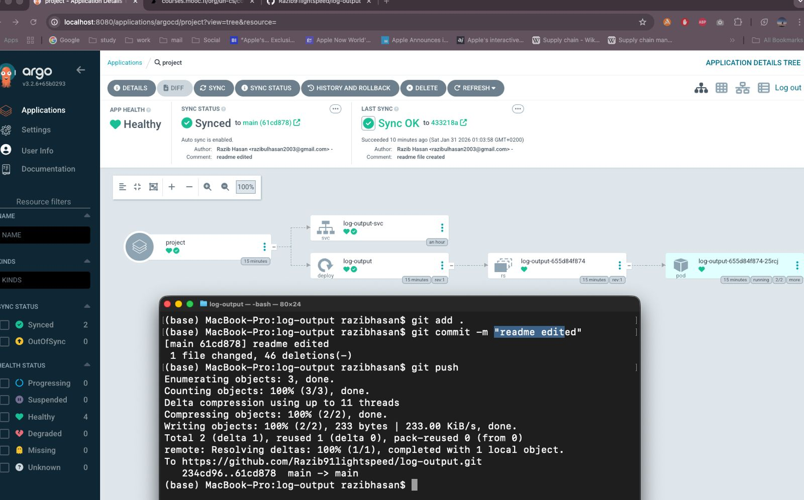

# Exercise 4.8 – GitOps Deployment

This exercise verifies that the project is deployed using GitOps with Argo CD.

The application is connected to the GitHub repository and configured with auto-sync enabled. Any commit pushed to the `main` branch automatically triggers a deployment update in the Kubernetes cluster.

Proof of GitOps workflow:

- A change was committed and pushed to the repository
- Argo CD detected the new commit
- The application synced automatically
- Status shows **Healthy** and **Synced**

## Screenshot proof

This confirms that the cluster state is fully managed from Git and updates happen automatically after commits.

# End