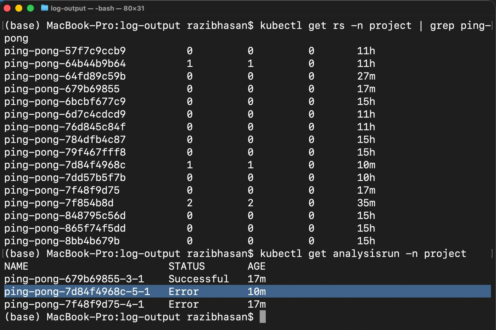
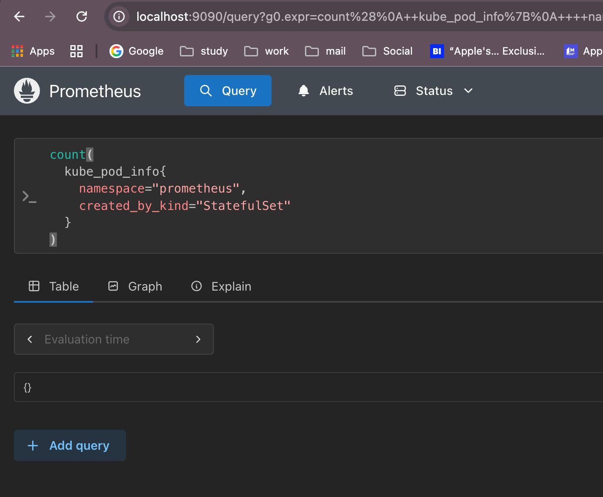

# Exercise 4.4 – Canary Deployment with CPU-Based Analysis (Ping-pong App)

## Goal

The purpose of this exercise is to demonstrate a canary deployment using Argo Rollouts,
where Prometheus is used to monitor CPU usage and automatically stop unsafe updates.

An AnalysisTemplate is configured to track the total CPU usage of all containers in the
`project` namespace during a rollout. If the CPU usage exceeds a predefined threshold,
the rollout is aborted and the stable version remains active.

---

## AnalysisTemplate (CPU Monitoring)

An AnalysisTemplate named `ping-pong-cpu-usage` was created with the following behavior:

- Uses Prometheus as the metrics provider
- Queries total CPU usage for all containers in the namespace
- Evaluates CPU usage at regular intervals
- Fails if CPU usage exceeds a hardcoded threshold
- Causes the rollout to abort automatically on failure

This ensures that high CPU usage prevents unsafe versions from being deployed.

---

## Canary Rollout Strategy

The Ping-pong application was deployed as an Argo Rollout with a canary strategy:

- 50% of traffic is routed to the new version
- CPU usage analysis is executed at this stage
- If analysis succeeds, rollout may continue to 100%
- If analysis fails, the rollout is aborted automatically

Separate services were used for traffic control:
- ping-pong-stable
- ping-pong-canary

---

## AnalysisRun Results

The following command was used to inspect analysis runs:

kubectl get analysisrun -n project

Observed results:
- One successful AnalysisRun
- Multiple AnalysisRuns with status `Error`

This proves that:
- The AnalysisTemplate was executed
- CPU thresholds were enforced
- The rollout was stopped when limits were exceeded

---

## ReplicaSet State Verification

The following command was used to verify ReplicaSets:

kubectl get rs -n project | grep ping-pong

Observations:
- Multiple ReplicaSets exist
- Older (stable) ReplicaSet still has running replicas
- New ReplicaSets did not scale to the full replica count

This confirms that the rollout did NOT reach 100%.

---

## Rollout Status Verification

The rollout state was verified using:

kubectl describe rollout ping-pong -n project

Key observations:
- Rollout phase is `Progressing`
- Canary step is active
- AnalysisRun errors are recorded
- Rollout did not complete successfully

---

## Screenshot Evidence

The following screenshot is included as proof:



The screenshot shows:
- Failed AnalysisRun entries
- ReplicaSets not fully scaled
- Rollout blocked before reaching 100%

```bash
kubectl describe rollout ping-pong -n project
```
~~~bash
Name:         ping-pong
Namespace:    project
Labels:       <none>
Annotations:  rollout.argoproj.io/revision: 5
API Version:  argoproj.io/v1alpha1
Kind:         Rollout
Metadata:
  Creation Timestamp:  2026-01-28T07:59:52Z
  Generation:          11
  Resource Version:    1769590566783983002
  UID:                 62570b17-8b24-4f44-8d00-c8794a3a67c1
Spec:
  Replicas:  2
  Selector:
    Match Labels:
      App:  ping-pong
  Strategy:
    Canary:
      Canary Service:  ping-pong-canary
      Stable Service:  ping-pong-stable
      Steps:
        Set Weight:  50
        Analysis:
          Analysis Run Metadata:
          Templates:
            Template Name:  ping-pong-cpu-usage
        Set Weight:         100
  Template:
    Metadata:
      Annotations:
        exercise-4-4:     trigger
        Final - Restart:  true
        Force - Fail:     now
        Force - Restart:  now
      Labels:
        App:  ping-pong
    Spec:
      Containers:
        Env:
          Name:             PORT
          Value:            3000
          Name:             POSTGRES_HOST
          Value:            postgres
          Name:             POSTGRES_DB
          Value:            pingpong
          Name:             POSTGRES_USER
          Value:            pingpong
          Name:             POSTGRES_PASSWORD
          Value:            pingpong
        Image:              europe-north1-docker.pkg.dev/project-d585011e-65cd-481e-b8a/k8s-images/ping-pong:fixed
        Image Pull Policy:  Always
        Liveness Probe:
          Http Get:
            Path:                 /healthz
            Port:                 3000
          Initial Delay Seconds:  20
          Period Seconds:         5
        Name:                     ping-pong
        Ports:
          Container Port:  3000
          Protocol:        TCP
        Readiness Probe:
          Http Get:
            Path:                 /healthz
            Port:                 3000
          Initial Delay Seconds:  5
          Period Seconds:         5
        Resources:
Status:
  HPA Replicas:        3
  Abort:               true
  Aborted At:          2026-01-28T08:53:08Z
  Available Replicas:  1
  Blue Green:
  Canary:
    Current Step Analysis Run Status:
      Message:  Metric "cpu-usage" assessed Error due to consecutiveErrors (5) > consecutiveErrorLimit (4): "Error Message: invalid operation: < (mismatched types []float64 and float64)"
      Name:     ping-pong-7d84f4968c-5-1
      Status:   Error
  Conditions:
    Last Transition Time:  2026-01-28T08:19:29Z
    Last Update Time:      2026-01-28T08:19:29Z
    Message:               Rollout does not have minimum availability
    Reason:                AvailableReason
    Status:                False
    Type:                  Available
    Last Transition Time:  2026-01-28T08:27:07Z
    Last Update Time:      2026-01-28T08:27:07Z
    Message:               RolloutCompleted
    Reason:                RolloutCompleted
    Status:                False
    Type:                  Completed
    Last Transition Time:  2026-01-28T08:53:08Z
    Last Update Time:      2026-01-28T08:53:08Z
    Message:               Rollout aborted update to revision 5: Metric "cpu-usage" assessed Error due to consecutiveErrors (5) > consecutiveErrorLimit (4): "Error Message: invalid operation: < (mismatched types []float64 and float64)"
    Reason:                RolloutAborted
    Status:                False
    Type:                  Progressing
  Current Pod Hash:        7d84f4968c
  Current Step Hash:       66f68974b9
  Current Step Index:      0
  Message:                 RolloutAborted: Rollout aborted update to revision 5: Metric "cpu-usage" assessed Error due to consecutiveErrors (5) > consecutiveErrorLimit (4): "Error Message: invalid operation: < (mismatched types []float64 and float64)"
  Observed Generation:     11
  Phase:                   Degraded
  Ready Replicas:          1
  Replicas:                3
  Selector:                app=ping-pong
  Stable RS:               7f854b8d
  Updated Replicas:        1
Events:
  Type     Reason                  Age                From                 Message
  ----     ------                  ----               ----                 -------
  Normal   RolloutUpdated          44m                rollouts-controller  Rollout updated to revision 1
  Normal   NewReplicaSetCreated    44m                rollouts-controller  Created ReplicaSet ping-pong-7f854b8d (revision 1)
  Normal   RolloutNotCompleted     44m                rollouts-controller  Rollout not completed, started update to revision 1 (7f854b8d)
  Normal   ScalingReplicaSet       44m                rollouts-controller  Scaled up ReplicaSet ping-pong-7f854b8d (revision 1) from 0 to 2
  Normal   RolloutCompleted        44m                rollouts-controller  Rollout completed update to revision 1 (7f854b8d): Initial deploy
  Normal   RolloutUpdated          36m                rollouts-controller  Rollout updated to revision 2
  Normal   NewReplicaSetCreated    36m                rollouts-controller  Created ReplicaSet ping-pong-64fd89c59b (revision 2)
  Normal   RolloutNotCompleted     36m                rollouts-controller  Rollout not completed, started update to revision 2 (64fd89c59b)
  Normal   ScalingReplicaSet       36m                rollouts-controller  Scaled up ReplicaSet ping-pong-64fd89c59b (revision 2) from 0 to 1
  Normal   RolloutUpdated          26m                rollouts-controller  Rollout updated to revision 3
  Normal   NewReplicaSetCreated    26m                rollouts-controller  Created ReplicaSet ping-pong-679b69855 (revision 3)
  Normal   ScalingReplicaSet       26m                rollouts-controller  Scaled down ReplicaSet ping-pong-64fd89c59b (revision 2) from 1 to 0
  Normal   AnalysisRunRunning      26m                rollouts-controller  Step Analysis Run 'ping-pong-679b69855-3-1' Status New: 'Running' Previous: ''
  Normal   ScalingReplicaSet       26m                rollouts-controller  Scaled up ReplicaSet ping-pong-679b69855 (revision 3) from 0 to 1
  Normal   RolloutUpdated          26m                rollouts-controller  Rollout updated to revision 4
  Normal   NewReplicaSetCreated    26m                rollouts-controller  Created ReplicaSet ping-pong-7f48f9d75 (revision 4)
  Normal   ScalingReplicaSet       26m                rollouts-controller  Scaled down ReplicaSet ping-pong-679b69855 (revision 3) from 1 to 0
  Normal   ScalingReplicaSet       26m                rollouts-controller  Scaled up ReplicaSet ping-pong-7f48f9d75 (revision 4) from 0 to 1
  Normal   AnalysisRunRunning      26m                rollouts-controller  Step Analysis Run 'ping-pong-7f48f9d75-4-1' Status New: 'Running' Previous: ''
  Warning  RolloutAborted          23m                rollouts-controller  Rollout aborted update to revision 4: Metric "cpu-usage" assessed Error due to consecutiveErrors (5) > consecutiveErrorLimit (4): "Error Message: invalid operation: < (mismatched types []float64 and float64)"
  Warning  AnalysisRunError        23m                rollouts-controller  Step Analysis Run 'ping-pong-7f48f9d75-4-1' Status New: 'Error' Previous: 'Running'
  Normal   RolloutUpdated          19m                rollouts-controller  Rollout updated to revision 5
  Normal   NewReplicaSetCreated    19m                rollouts-controller  Created ReplicaSet ping-pong-7d84f4968c (revision 5)
  Normal   RolloutStepCompleted    19m (x3 over 26m)  rollouts-controller  Rollout step 1/3 completed (setWeight: 50)
  Normal   ScalingReplicaSet       19m                rollouts-controller  Scaled down ReplicaSet ping-pong-7f48f9d75 (revision 4) from 1 to 0
  Normal   ScalingReplicaSet       19m                rollouts-controller  Scaled up ReplicaSet ping-pong-7d84f4968c (revision 5) from 0 to 1
  Normal   RolloutAddedToInformer  11m                rollouts-controller  Rollout resource added to informer: project/ping-pong
  Normal   AnalysisRunRunning      11m                rollouts-controller  Step Analysis Run 'ping-pong-7d84f4968c-5-1' Status New: 'Running' Previous: ''
  Warning  AnalysisRunError        10m                rollouts-controller  Step Analysis Run 'ping-pong-7d84f4968c-5-1' Status New: 'Error' Previous: 'Running'
  Warning  RolloutAborted          10m                rollouts-controller  Rollout aborted update to revision 5: Metric "cpu-usage" assessed Error due to consecutiveErrors (5) > consecutiveErrorLimit (4): "Error Message: invalid operation: < (mismatched types []float64 and float64)"
(base) MacBook-Pro:log-output razibhasan$ 
~~~


---

## Explanation of the Requirement

“Make sure that the application doesn't get updated, if the value is set too low” means:

- The CPU threshold is intentionally configured very low
- Normal application CPU usage exceeds the threshold
- AnalysisRun fails
- Argo Rollouts aborts the deployment
- The stable version continues serving traffic
- The new version is never fully deployed

This behavior was successfully demonstrated.

---

## Conclusion

This exercise confirms that:

- Prometheus metrics can be used to guard deployments
- Argo Rollouts can automatically stop unsafe updates
- Canary deployments prevent faulty versions from reaching production
- CPU-based analysis is an effective safety mechanism

Exercise 4.4 completed successfully.


~~~bash
kubectl -n prometheus port-forward \
  prometheus-kube-prometheus-stack-prometheus-0 9090:9090
~~~




---

