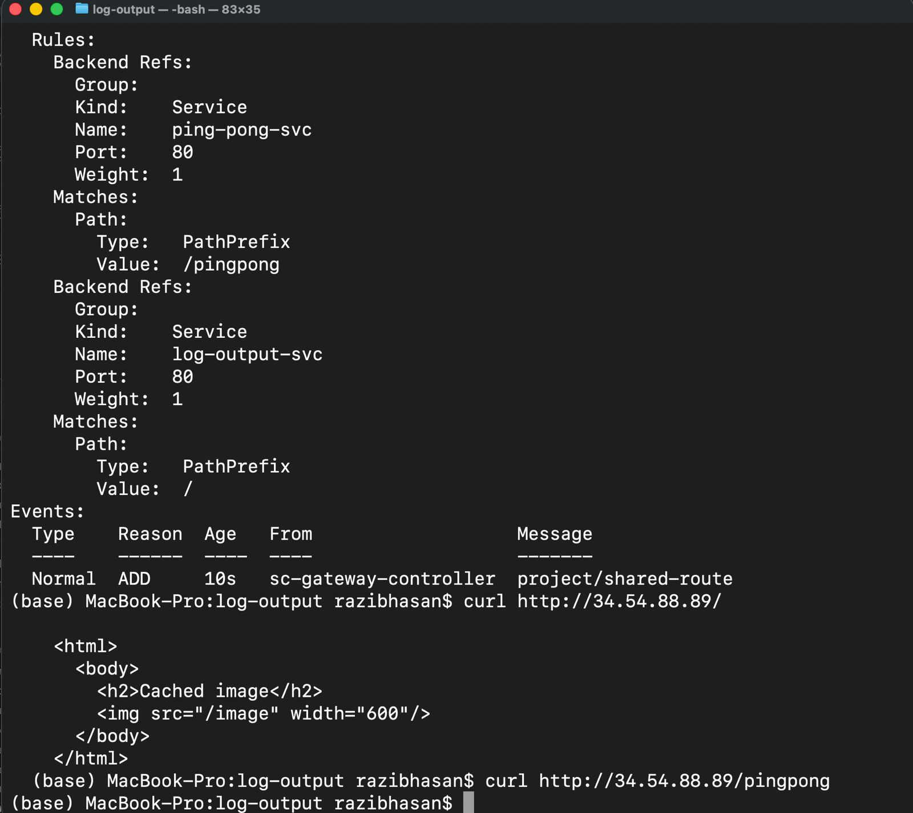

# Kubernetes Exercise 3.3 – Gateway API

This repository contains the solution for **Exercise 3.3 (To the Gateway)**.

In this exercise, the Kubernetes **Ingress** resource was replaced with the **Gateway API**, which is the newer and more expressive way to manage external traffic routing in Kubernetes on Google Kubernetes Engine (GKE).

---

## 🔄 What Was Done

### 1. Ingress Removed
- The previously used Ingress resource (from Exercise 3.2) was deleted.
- External traffic routing is now fully handled by the Gateway API.

### 2. Gateway API Enabled
- Gateway API support was enabled on the GKE cluster using:
  ```bash
  gcloud container clusters update dwk-cluster \
    --location=europe-north1-b \
    --gateway-api=standard
```
### 3. Services Updated
The services `log-output-svc` and `ping-pong-svc` were changed from **NodePort** to **ClusterIP**, as required by the Gateway API.

### 4. Gateway Created
A `Gateway` resource was created using the recommended GKE `GatewayClass`:

- `gke-l7-global-external-managed`

The Gateway listens for HTTP traffic on port 80 and automatically provisions a GCP Layer 7 load balancer.

### 5. HTTPRoute Created
An `HTTPRoute` resource was created to define path-based routing:

- `/` → `log-output-svc`
- `/pingpong` → `ping-pong-svc`

The route is explicitly attached to the Gateway listener.

---

## 🌐 Verification

After applying the Gateway and HTTPRoute, the Gateway was assigned a public IP address.

Traffic routing was verified using:

```bash
curl http://http://34.54.88.89//
curl http://http://34.54.88.89//pingpong
```
The root path served the log-output application, and `/pingpong` was routed to the ping-pong application.

## Proof of Completion

The following screenshots demonstrate successful completion of Exercise 3.3.





