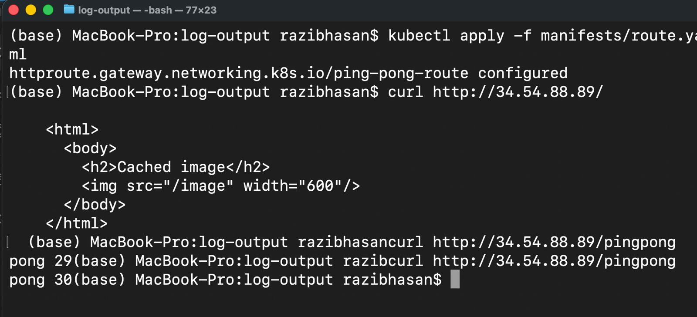

# Exercise 3.4 – Rewritten Routing (Gateway API)

## Objective

The goal of this exercise was to decouple the application’s internal routing from the cluster-level URL structure.
Previously, the ping-pong application had to respond to `/pingpong` directly. In this task, the application was modified to respond at the root path `/`, while the Kubernetes Gateway API rewrites external requests from `/pingpong` to `/`.

This demonstrates how routing concerns can be handled at the gateway level instead of inside the application.

---

## Key Idea

- External clients access the service via `/pingpong`
- The Gateway rewrites `/pingpong` → `/`
- The ping-pong application only implements logic at `/`
- The application no longer needs to know how it is exposed in the cluster

This approach improves portability and separation of concerns.

---

## Application Changes

### Ping-pong application (`ping-pong/index.cjs`)

- The counter increment logic was moved to the root path `/`
- The `/pingpong` path was removed from the application
- The application now:
  - Handles `/` for ping-pong functionality
  - Optionally responds to `/health` for health checks

This ensures the application works independently of the external URL structure.

---

## Kubernetes Changes

### Deployment

- The ping-pong Deployment was updated to use the new application image
- Correct labels, container name, and image version were ensured
- Environment variables for PostgreSQL remained unchanged

File:
- `ping-pong/manifests/deployment.yaml`

---

### Gateway API HTTPRoute

An HTTPRoute was configured to:
- Match requests with the path prefix `/pingpong`
- Rewrite the prefix `/pingpong` to `/` using `ReplacePrefixMatch`
- Forward traffic to the `ping-pong` service

Important note:
- `ReplacePrefixMatch` requires a `PathPrefix` match
- Using `Exact` matching is invalid with this rewrite type and is rejected by Kubernetes

File:
- `manifests/route.yaml`

---

## Verification

The setup was verified by accessing the service through the Gateway external IP.

Expected behavior:
- `GET /pingpong` returns `pong <counter>`
- Repeated requests increment the counter
- The application itself only handles `/`

Screenshots demonstrating the working setup are included as proof:

---

## Result

- Routing logic is handled entirely by the Gateway API
- The application is simpler and more portable
- The exercise requirements are fully satisfied
