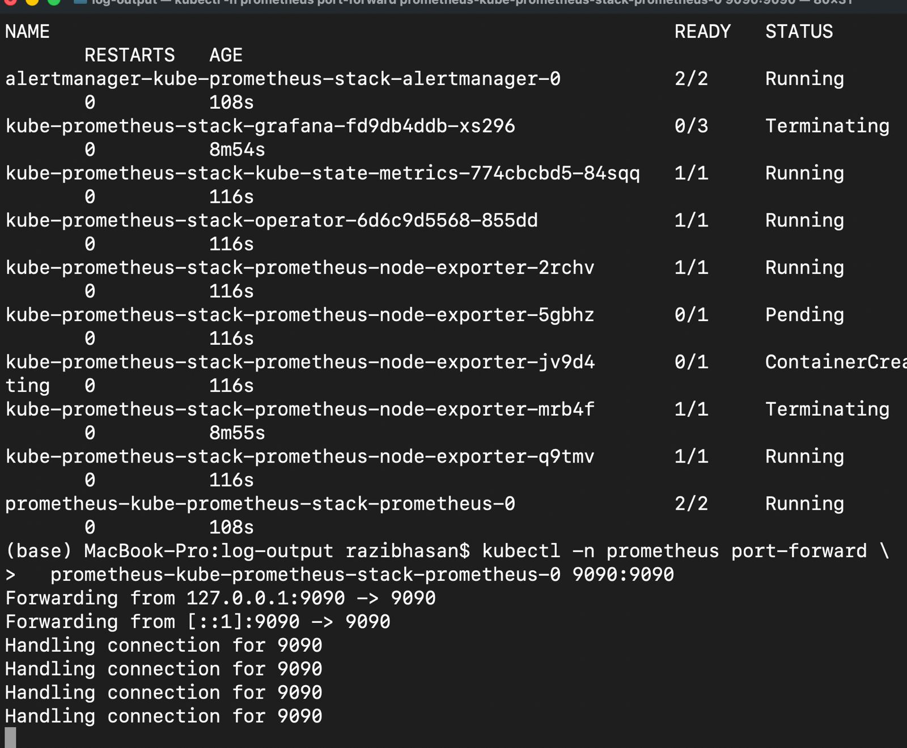

# Exercise 4.3 – Prometheus Query

## Goal

The goal of this exercise is to gain hands-on experience with Prometheus by running a simple PromQL query and understanding how Kubernetes metrics can be queried.

Specifically, the task is to write a query that shows the number of pods created by **StatefulSets** in the `prometheus` namespace.

---

## Prometheus Setup

Prometheus was installed using **Helm** into the `prometheus` namespace.
After installation, the Prometheus web UI was accessed locally using `kubectl port-forward` on port **9090**, which is the default Prometheus port.

---

## Verifying Prometheus Components

The following command was used to verify that Prometheus and related components were running:

~~~bash
kubectl -n prometheus get pods
~~~

The output confirms that the Prometheus server pod and kube-state-metrics are running:

~~~text
prometheus-kube-prometheus-stack-prometheus-0   2/2   Running
kube-prometheus-stack-kube-state-metrics        1/1   Running
~~~

---

## Port-forwarding Prometheus

Prometheus was made accessible locally using:

~~~bash
kubectl -n prometheus port-forward \
  prometheus-kube-prometheus-stack-prometheus-0 9090:9090
~~~

This allowed access to the Prometheus UI at:

~~~text
http://localhost:9090
~~~

---

## PromQL Query

The following PromQL query was executed in the Prometheus web interface:

~~~promql
count(
  kube_pod_info{
    namespace="prometheus",
    created_by_kind="StatefulSet"
  }
)
~~~

---

## Result and Explanation

The query returned an **empty result (`{}`)**.

This means that, in the current Prometheus setup, there are **no pods in the `prometheus` namespace created by a StatefulSet**.

This is expected with newer versions of `kube-prometheus-stack`, where:
- Node Exporter is deployed as a **DaemonSet**
- Prometheus is managed via custom resources
- The deployment differs from the older course example

In older setups, this same query may return **3**, but the difference is due to changes in how components are deployed in modern Helm charts.

---

## Proof

### Terminal Verification

The following screenshot shows the running Prometheus components and the active port-forward session:

### Prometheus Query Result

The following screenshot shows the executed PromQL query and the empty result in the Prometheus UI:

---

## Conclusion

Although the result differs from the example shown in the course material, the query itself is correct and fulfills the exercise requirements.
